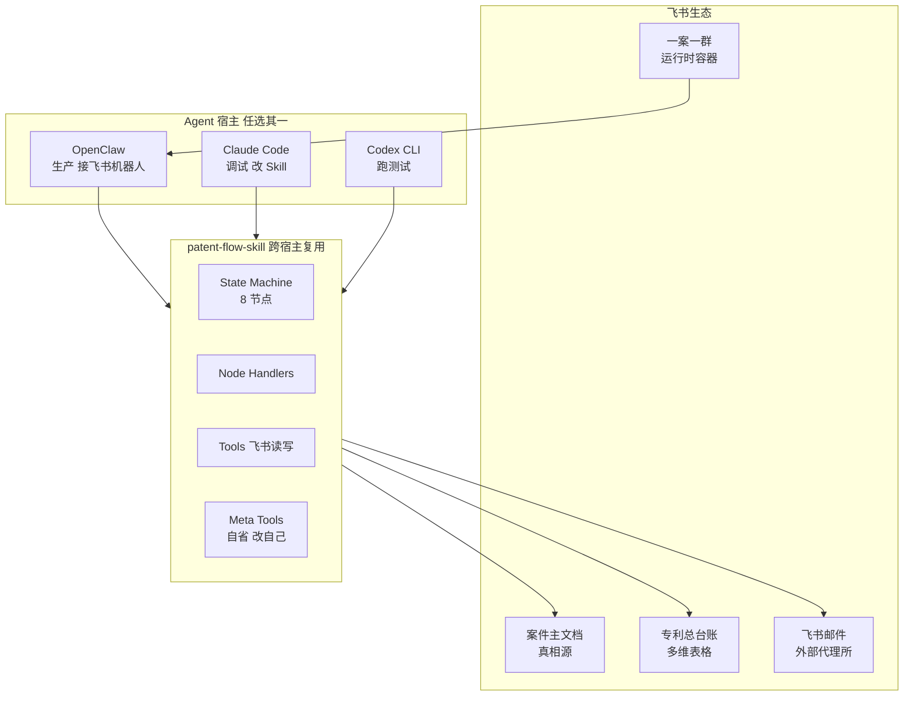
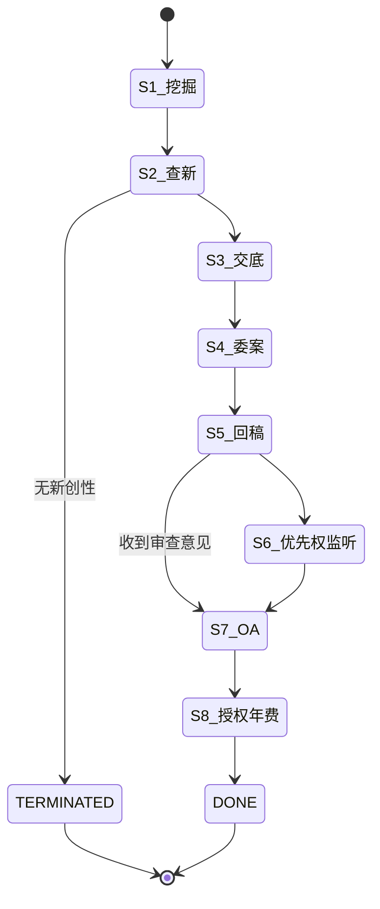
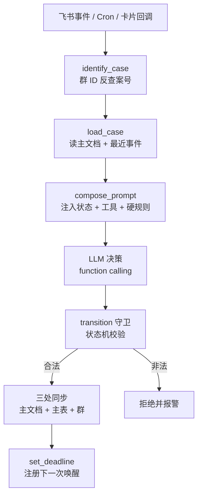

# 专利申请流程 AI Agent 方案设计
这是一个AI生成的，学习AI 工具开发的项目文档

> **文档目的**：基于现有 8 节点专利全生命周期管理流程，设计一套轻量、可对话迭代、覆盖飞书生态的 AI Agent 自动化方案。
>
> **核心范式**：OpenClaw 做机器人壳子 + 飞书做唯一存储 + 一案一群做运行时容器 + 自写 Skill 做业务大脑 + Lark CLI 做基础设施。

---

## 一、项目背景与目标

### 1.1 现状
- 年专利申请量 **100+ 件**，月新增 10-20 件，月维护几十到 100 件
- 覆盖电视挂架、厨电、家居等多个产品线，专职 IPR **仅 1 人**
- 流程高度依赖人工流转与个人经验，存在被遗漏、超期、状态不可追溯的风险

### 1.2 目标
- 从专利挖掘到归档年费实现全闭环自动化管理
- 所有人机交互闭环在飞书内，研发/PM/IPR 不切换工具
- 方案轻量：单人可维护、可对话迭代、跨 Agent 宿主可移植

---

## 二、整体架构



> **关键解耦**：业务逻辑全在 Skill 里，宿主和存储都可替换。今天用 OpenClaw，明天换 Claude，后天换自研，业务零改动。

---

## 三、轻量级选型

| 维度 | 选型 | 放弃方案 | 理由 |
|---|---|---|---|
| 机器人壳子 | OpenClaw + 飞书官方插件 | 自建 FastAPI Webhook | 消息收发/会话/鉴权/Hook 全内置，零基础设施 |
| Agent 形态 | 跨宿主 Skill 包 | 单独服务 | 三端 Claude/Codex/OpenClaw 共用一份代码 |
| 飞书操作 | Lark CLI（官方开源） | 自写 SDK 调用 | 2500+ API 一行命令，官方维护 |
| 存储 | 飞书多维表格 + 文档 + 群 | SQLite/MySQL | IPR 直接打开看，零运维，飞书自带备份 |
| 调度 | OpenClaw Hooks + 多维表格自动化 | APScheduler/Airflow | 期限监控是日级低频任务，无需独立调度器 |
| 状态机 | YAML 定义 + 守卫函数 | LLM 自由对话 | 8 节点流程确定，状态机强约束防跳步 |
| 运行环境 | 1 台 2C4G 主机 | K8s/Serverless | 月百件量级单进程足够 |

---

## 四、存储设计

### 4.1 存储拓扑

> **收拢原则**：除飞书群（IM 侧对象，无法挂在文件树下）外，专利流程的一切存储——总台账、案件文件夹、模板——统一收拢在公司**知识库**下唯一的根节点 **`patent_flow/`** 之下，不再散落在租户顶层。新增/排查资源时只需认准这一个根节点。

```
公司知识库（飞书 Wiki）
└── 📁 patent_flow/                          ← 专利流程总目录（唯一根节点，token 记为 $PATENT_FLOW_ROOT_TOKEN）
     │
     ├── 📊 专利总台账.bitable                ← 全局索引 + 状态看板
     │      ├── 案件主表（主键：案号）
     │      ├── 事件流水（关联到主表）
     │      └── 待办/截止（过滤视图，仪表盘）
     │
     ├── 📁 templates/
     │    └── 案件主文档模板.docx
     │
     └── 📁 cases/2026/
          ├── 📁 2026017CNU - 电视挂架自适应卡扣/
          │    ├── 📄 00_案件主文档.docx     ← Agent 的"病历本"，单一真相源
          │    ├── 📄 01_挖掘会议纪要.docx
          │    ├── 📄 02_查新报告.docx
          │    ├── 📄 03_技术交底书_v3.docx
          │    ├── 📄 04_委案邮件存档.docx
          │    ├── 📄 05_代理稿_v1.docx
          │    ├── 📄 07_OA通知书.pdf
          │    └── 📄 08_授权证书.pdf
          └── ...（其余案件同级）

💬 群「[2026017CNU] 电视挂架自适应卡扣」  ← 运行时容器（IM 侧对象，独立于知识库文件树）
   ├── 群公告（状态镜像）
   ├── Pin（指向 patent_flow/cases/2026/2026017CNU.../00_案件主文档.docx）
   ├── 群文件（挂载到 patent_flow/cases/2026/2026017CNU.../ 目录）
   └── 消息（Agent 决策上下文来源）
```

### 4.2 顶层多维表格 schema

#### 表 1：案件主表

| 字段 | 类型 | 说明 |
|---|---|---|
| 案号 | 单行文本 主键 | 2026017CNU |
| 群 ID | 单行文本 | 一案一群的群唯一标识，反查入口 |
| 案件文件夹 | 链接 | 云盘目录 |
| 案件主文档 | 链接 | 00_案件主文档.docx |
| 当前节点 | 单选 | S1/S2/.../S8/DONE/TERMINATED |
| 当前子步骤 | 单行文本 | S6.2 等待 PM 决策 |
| 状态 | 单选 | running / waiting_human / blocked / done |
| 等待对象 | 人员 | @PM |
| 截止日期 | 日期 | 2026-06-15 |
| 下一步动作 | 单行文本 | PM 回填申请美国/放弃 |
| 品线 | 单选 | 家庭影音/厨电/家居 |
| 申请日 | 日期 | — |
| 优先权到期日 | 公式 | 申请日 + 10 个月 |
| 年费到期日 | 日期 | — |

#### 表 2：事件流水
append-only，承担审计和回溯职责。字段：`案号 / 时间 / 来源(agent|ipr|pm|system) / 事件类型 / 摘要 / 详情链接`。

#### 表 3：待办/截止
多维表格视图过滤：`状态=waiting_human AND 截止日期 < TODAY()+3`，配合自动化触发器催办告警。

### 4.3 案件主文档结构（关键设计）

> **主文档是 Agent 的全部上下文**，也是 IPR 的查阅入口。用 HTML 注释划出 `agent:state` / `agent:elements` / `agent:log` 区块作为 Agent 可读写区，注释外的字段供人手动维护，解决"人机共编"冲突。

```markdown
# 案件 2026017CNU — 电视挂架自适应卡扣机构

## 📌 当前状态  <!-- agent:state:begin -->
- 节点：S6.2 产品经理商业价值评估
- 状态：waiting_human
- 等待：@PM 回填优先权决策
- 截止：2026-06-15（剩 4 天）
- 下一步：超期则升级到 leader
<!-- agent:state:end -->

## 📇 基础信息
品线 / 申请类型 / 发明人 / IPR / 代理所 / 申请日 / 优先权到期 ...

## 🧩 技术三要素  <!-- agent:elements:begin -->
技术问题 / 技术方案 / 技术效果
<!-- agent:elements:end -->

## 📂 关联文件
| 类型 | 文件 | 版本 | 日期 |

## 📜 事件日志  <!-- agent:log:begin -->
最近 20 条倒序，更早归档到事件流水表
<!-- agent:log:end -->

## 🔁 决策记录
人工撰写的关键决策回顾
```

---

## 五、状态机设计

### 5.1 8 节点流转图



### 5.2 YAML 定义示例

```yaml
# state_machine.yaml
states:
  S1_mining:
    on_complete: S2_search
    timeout: 7d
    human_gate: ipr_confirm_three_elements
  S2_search:
    on_complete: [S3_disclosure, TERMINATED]
    human_gate: ipr_decide_continue
  S4_filing:
    on_complete: S5_review
    auto: true
    triggers: [approval_passed]
  S6_priority_watch:
    parallel_to: [S7_oa]
    triggers: [cron_monthly, ten_month_due]
  # ...
```

### 5.3 守卫函数（强约束）

```python
def transition(case_no, to_node, evidence):
    cur = load_case(case_no)
    allowed = STATE_MACHINE[cur.current_node]["on_complete"]
    assert to_node in allowed, f"非法跳转 {cur.current_node}→{to_node}"
    # 1. append-only 先写事件流水
    bitable.add_row("事件流水", {...})
    # 2. 写主文档 agent:state 区块（真相源）
    lark_doc.update_block(case_no, "agent:state", {...})
    # 3. 同步主表 + 群公告 + 群名 + 群播报
    bitable.update_row("案件主表", case_no, {...})
    lark_im.update_chat_announcement(chat_id, render(...))
    lark_im.update_chat_name(chat_id, f"[{case_no}] ... - {to_node}")
    lark_im.send(chat_id, f"🔄 节点跳转 {from_node} → {to_node}")
```

> LLM 无论怎么"想"，都跳不出这张状态机图。所有写操作走 `transition()` 一个函数 → 主文档 / 主表 / 群三处永远一致。

---

## 六、一案一群范式

### 6.1 核心理念

> **群 = 案件的运行时容器**
> - 群里的人 = 该案利益相关方（IPR / 研发 / PM / leader）
> - 群里的话 = 案件的对话历史
> - 群文件 = 案件的归档
> - 群公告 = 当前状态（镜像主文档）
> - 群机器人 = Agent 入口
> - **群 ID ↔ 案号 一一映射**，Agent 再也不需要 identify_case

### 6.2 群标准化布局

| 元素 | 规范 | 由谁维护 |
|---|---|---|
| 群名 | `[2026017CNU] 电视挂架自适应卡扣 - S2查新中` | Agent 自动更新 |
| 群公告 | 当前节点 / 状态 / 截止 / 主文档链接 / 常用命令 | Agent 自动更新 |
| Pin 消息 | 主文档链接 + 当前节点说明 | Agent |
| 群文件目录 | 01_挖掘 / 02_查新 / 03_交底书 / ... / 08_授权 | Agent 自动建 |
| 成员 | IPR(管理员) + 研发 + PM + leader(按需) | IPR 初始化，Agent 维护 |
| 外部代理所 | **不入群**，走邮件 | — |

### 6.3 典型交互场景

#### 场景 1：新案件诞生
```
IPR @bot: 新建案件 电视挂架自适应卡扣 品线=家庭影音 研发=@李四@王五
Bot: 已创建群「[2026017CNU] 电视挂架自适应卡扣」, 已邀请成员
```

#### 场景 2：S1 挖掘（群内对话）
```
Bot: @研发 请上传技术说明和 3D 模型图
研发: [上传 2 个文件]
Bot: 已归档到 📁 01_挖掘/, AI 提炼出 3 个待澄清问题 ...
     [开始挖掘会] [先改提纲]
```

#### 场景 3：S6 优先权决策（Agent 主动唤起）
```
(10 个月后某天 9:00, Agent 自动在群里发)
Bot: ⏰ @PM 优先权决策提醒
     距优先权到期: 2 个月
     产品销量摘要: ...
     [申请美国] [申请欧洲] [都申请] [放弃]
```

### 6.4 意图识别分档（避免打扰）

| 触发方式 | 处理 | LLM 成本 |
|---|---|---|
| @bot + 命令（@bot status） | 正则解析，本地处理 | 0 |
| @bot + 自然语言 | LLM function calling | 1 次 |
| 群内文件上传 / 关键事件 | LLM 自动归档 + 询问 | 1 次 |
| 普通聊天（人和人讨论） | 不响应，但记录到群历史 | 0 |

---

## 七、Agent 唤醒与决策流程



### 7.1 Prompt 模板

```
你在群「[2026017CNU] 电视挂架自适应卡扣 - S2查新中」里。

【案件状态】（从主文档 agent:state 区块解析）
节点: S2.4 差异性比对
状态: waiting_human (等 IPR @张三 判定流转)
截止: 2026-06-15

【群最近 20 条消息】（从 lark_im.get_recent_msgs 拉）
[10:00] @张三: 这个对比文件 CN12345 我看了，方案差太多
[10:01] @李四: 我们的核心是双向自锁，对比文件只有单向
[10:02] @张三: 同意，可以进 S3

【刚收到的事件】
@张三 @bot 进入下一步

【可用工具】
- transition(to_node="S3_disclosure", ...)
- update_chat_state(chat_id, ...)
- send_card_to_chat(...)

【硬规则】
- S2 → 只能跳 S3 或 TERMINATED
- 跳转前必须有 IPR 明确确认
```

> **核心思想**：LLM 无状态，每次都把它当成新员工，在 prompt 里把"病历本"递过去。不依赖对话历史记忆，避免 token 爆炸和幻觉。

### 7.2 长流程不丢事 — 三套唤醒触发器

| 触发器 | 实现 | 用途 |
|---|---|---|
| 飞书回调 | 卡片按钮 / 审批通过 / @bot 消息 | 短期人机交互，分钟级 |
| OpenClaw Hook (cron) | 每日 9:00 扫多维表格"截止日期"视图 | 兜底，发现到期 |
| 多维表格自动化 | 截止日 < TODAY()+3 触发 webhook | 告警、催办 |

---

## 八、跨宿主 Skill 包设计

### 8.1 三层 Skill 树（实际落地结构）

> 与最初设想的"一个 SKILL.md 打天下"不同，实际落地把 Skill 拆成了**三层**，每一层都是独立的 `skills/<layer>/<name>/SKILL.md`，靠自己的 `description` 触发，靠 `metadata.requires.skills` 声明对下层的依赖：

```
workflow/patent-flow          ← 顶层：唯一编排入口，读状态 + 路由决策，不碰 lark-cli
   │
   ├─ task/patent-case-init          （新案件初始化）
   ├─ task/patent-mining             （S1，人工确认三要素）
   ├─ task/patent-search             （S2，唯一有 TERMINATED 分支）
   ├─ task/patent-disclosure         （S3，格式/图号校验）
   ├─ task/patent-filing             （S4，P1 全自动）
   ├─ task/patent-review             （S5，形审 diff）
   ├─ task/patent-priority-watch     （S6，P1 全自动，cron 驱动）
   ├─ task/patent-oa                 （S7，两段式人工确认）
   ├─ task/patent-grant-annuity      （S8，P1 全自动，cron 驱动）
   ├─ task/patent-deadline-scan      （S6/S8 的每日 cron 扫描入口）
   └─ task/patent-self-evolve        （对话式自我进化）
        │
        └─ tool/patent-cli           ← 底层：唯一原子命令层，被以上所有 task 调用
```

**分层职责边界（不可跨层跳过）**：
- **workflow 层**（1 个）：`identify_case` → `load_case` → 按当前节点路由到对应 task skill → 校验状态机 → 触发同步。只做路由和守卫，不做具体业务判断。
- **task 层**（11 个）：每个节点（或跨节点的期限扫描 / 自我进化）一个 skill，负责"这一步该收集什么信息、该问用户什么"，把结构化输入整理好后交给 tool 层执行。
- **tool 层**（1 个）：只暴露原子命令（`load_case.sh` / `run_node.sh` / `transition.sh` / `append_event.sh` / `scan_deadlines.sh` / `meta/*`），不做任何业务判断。

对应的仓库物理结构：

```
patent_flow/                          ← 一个 git 仓库（即本项目根目录）
├── CLAUDE.md                         ← Claude Code 项目说明
├── plugin.json                       ← OpenClaw 元信息，列出 13 个 skill 路径
├── pyproject.toml                    ← 纯 Python 包，可独立 pip install -e .
│
├── patent_flow/                      ← 核心业务（宿主无关，被 skills/ 调用）
│   ├── state_machine.yaml / state_machine.py   ← 状态机定义 + 守卫函数
│   ├── store.py                      ← 飞书读写（Lark CLI 薄壳）
│   ├── transition.py                 ← 唯一的状态写入口
│   ├── workflow.py                   ← 编排：identify_case / dispatch / apply_result / scan_deadlines
│   ├── registry.py                   ← 节点名 → handler 映射
│   ├── dates.py                      ← 到期日计算（无外部依赖）
│   ├── cli.py                        ← python -m patent_flow <cmd>
│   └── nodes/                        ← 8 个节点 handler（纯决策函数，返回 NodeResult）+ base.py
│
├── skills/                           ← 三层 Skill 树，是本仓库对宿主的唯一入口
│   ├── workflow/patent-flow/SKILL.md
│   ├── task/patent-{case-init,mining,search,disclosure,filing,review,
│   │              priority-watch,oa,grant-annuity,deadline-scan,self-evolve}/SKILL.md
│   └── tool/patent-cli/SKILL.md
│
├── tools/                            ← skills/tool/patent-cli 背后的薄壳脚本
│   ├── load_case.sh / run_node.sh / transition.sh / append_event.sh / scan_deadlines.sh
│   └── meta/                         ← 自省工具（让 Agent 改自己）
│       ├── list_skill_files.sh / read_skill_file.sh
│       └── propose_patch.sh / apply_patch.sh / run_tests.sh
│
├── hooks/                            ← OpenClaw 用
│   └── daily_deadline_scan.yaml      ← 唯一的每日 cron，S6/S8 各自的 REMIND_DAYS 天数档已含节奏
│
├── scripts/
│   └── link_skills.sh                ← 把 skills/<layer>/<name>/ 逐个软链到两端宿主
│
└── tests/
    ├── test_state_machine.py / test_store.py / test_registry.py
    ├── test_nodes.py / test_workflow.py
    └── test_e2e_dry_run.py
```

### 8.2 两端实时加载方式

| 宿主 | 加载命令 | 适合场景 |
|---|---|---|
| Claude Code | `bash scripts/link_skills.sh` 软链到 `~/.claude/skills/<name>` | **调试 / 改 Skill**：对话式迭代，编辑即生效 |
| OpenClaw | 同一脚本同时软链到 `~/.openclaw/skills/<name>` | **生产**：接飞书机器人，跑 `hooks/` |

`scripts/link_skills.sh` 是幂等的：遍历 `skills/*/*/` 下每个含 `SKILL.md` 的目录，按目录名（如 `patent-flow`、`patent-mining`）分别软链到两端宿主的 skills 目录，新增 skill 目录后重跑一次即可生效，无需 `openclaw skills install` 或重启。

> **关键原则**：业务逻辑只暴露 CLI（`python -m patent_flow xxx`），工具脚本一律是薄壳；节点业务判断只暴露 `patent_flow.nodes.*.run()`，返回结构化的 `NodeResult` 而不是自己调用 `lark-cli`。宿主差异收敛在每个 `SKILL.md` 的 frontmatter 和 `hooks/` 文件夹，三层之间靠目录结构和 `metadata.requires.skills` 声明依赖，而不是靠一个巨大的顶层 `SKILL.md`。

---

## 九、Lark CLI 作为基础设施层

飞书官方 2026.3.28 开源的 Lark CLI（MIT 协议），覆盖 2500+ API、11 个业务领域、19 个 AI Agent Skills，所有飞书操作一行命令搞定。

### 9.1 能力对照

| 需求 | Lark CLI 子命令 |
|---|---|
| 定位知识库根节点（一次性） | `lark-cli wiki +node-list --space-id <space_id>` 找到 `patent_flow` 节点，记下其 token 为 `$PATENT_FLOW_ROOT_TOKEN` |
| 建文档目录（案件文件夹） | `lark-cli drive +folder-create --name "..." --parent-token $PATENT_FLOW_ROOT_TOKEN/cases/<year>` |
| 建文档 | `lark-cli docs +create --doc-format xml --content @body.xml` |
| 改文档内容 | `lark-cli docs +update --command str_replace / block_replace / append ...` |
| 更新文档目录树 | `lark-cli drive +move / +rename` |
| 发送飞书消息 | `lark-cli im +send --receive-id <chat_id> --msg-type text/post/interactive` |
| 建群 | `lark-cli im +chat-create --name "..." --user-ids ou_xxx,ou_yyy` |
| 改群公告/群名 | `lark-cli im +chat-update --announcement ... --name ...` |
| 群文件管理 | `lark-cli im +file-upload` + `lark-cli drive +file-move` |
| 多维表格读写 | `lark-cli base +record-create / +record-update / +query` |

> `$PATENT_FLOW_ROOT_TOKEN` 只需在知识库里手动建一次 `patent_flow/` 根节点（含 `专利总台账.bitable`、`templates/`、`cases/` 三个子节点）后取一次 token，后续所有案件文件夹、模板、台账都挂在这一个 token 下面，不再新建平行的顶层资源。

### 9.2 一案一群初始化脚本

```bash
# 1. 创建案件文件夹（挂在知识库 patent_flow 根目录下的 cases/<year>/ 节点下）
FOLDER_TOKEN=$(lark-cli drive +folder-create \
  --name "2026017CNU - 电视挂架自适应卡扣" \
  --parent-token "$PATENT_FLOW_ROOT_TOKEN/cases/2026")

# 2. 从模板复制主文档
DOC_TOKEN=$(lark-cli docs +copy \
  --source-token $TEMPLATE_DOC_TOKEN \
  --target-folder $FOLDER_TOKEN \
  --name "00_案件主文档")

# 3. 创建一案一群
CHAT_ID=$(lark-cli im +chat-create \
  --name "[2026017CNU] 电视挂架自适应卡扣 - S1挖掘" \
  --user-ids "$IPR_ID,$DEV1_ID,$DEV2_ID,$PM_ID" \
  --description "案件 2026017CNU 工作群，由 Patent-Agent 管理")

# 4. 设置群公告
lark-cli im +chat-update --chat-id $CHAT_ID \
  --announcement "📌 当前节点 S1.1 ... | 主文档: https://.../docx/$DOC_TOKEN"

# 5. 写入台账
lark-cli base +record-create --app-token $LEDGER_BASE --table-id tblxxx \
  --fields '{"案号":"2026017CNU","群ID":"'$CHAT_ID'","当前节点":"S1"}'
```

### 9.3 transition() 完整实现

```bash
function transition() {
  local case_no=$1 to_node=$2 evidence=$3

  # 1. 写事件流水（append-only，永远成功）
  lark-cli base +record-create --app-token $LEDGER_BASE --table-id tbl_events \
    --fields "{\"案号\":\"$case_no\",\"事件类型\":\"节点跳转\",\"摘要\":\"$evidence\"}"

  # 2. 更新主文档 agent:state 区块
  lark-cli docs +update --doc $DOC --command block_replace \
    --block-id $STATE_BLOCK_ID --content @new_state.xml

  # 3. 更新主表
  lark-cli base +record-update --app-token $LEDGER_BASE --table-id tbl_main \
    --record-id $REC_ID --fields "{\"当前节点\":\"$to_node\"}"

  # 4. 刷群公告 + 群名
  lark-cli im +chat-update --chat-id $CHAT_ID \
    --name "[$case_no] $TITLE - $to_node" \
    --announcement "$(render_announcement)"

  # 5. 群内播报
  lark-cli im +send --receive-id $CHAT_ID --msg-type text \
    --content "{\"text\":\"🔄 节点跳转 $FROM → $to_node\"}"
}
```

### 9.4 安装与配置

```bash
# 安装（npm）
npm install -g @larksuiteoapi/lark-cli

# 配置应用凭证
lark-cli auth login --app-id cli_xxx --app-secret xxx

# 验证
lark-cli im +chat-list --user-id-type open_id
```

OpenClaw 飞书插件已经内置了 Lark CLI 调用通道，装完插件就能在 Skill 里直接用。

---

## 十、对话式自我进化

### 10.1 三个能力

| 能力 | 工具 | 作用 |
|---|---|---|
| 自省 Introspect | `read_skill_file / list_skill_files / diff_skill` | Agent 能读自己的源码 |
| 受控编辑 Patch | `propose_patch → user approve → apply_patch` | 不直接覆盖文件，先输出 diff 等审核 |
| 版本化 Git | Skill 包就是 git 仓库 | 每次 apply_patch 自动 commit，可回滚 |

### 10.2 两道护栏

> **护栏 A：测试必须先过** — `apply_patch` 后自动跑 `pytest`，失败立即 `git reset --hard HEAD`。
>
> **护栏 B：双分支** — Agent 改 Skill 只能改 `dev` 分支，验证 OK 后人工 merge 到 `main` 再 `openclaw skills reload`。

### 10.3 对话样例

```
你: S6 的催办间隔太长了, PM 都不看, 改成 3 天一次

Agent: 好, 我先看一下当前实现。
       [read_skill_file patent_flow/nodes/s6_priority.py]

       现在是固定 7 天催办一次。我打算改成:
       - 首次催办: 截止前 14 天
       - 第二次: 截止前 7 天
       - 第三次: 截止前 3 天
       - 第四次: 截止前 1 天, 同时 @ 升级到 leader

       diff:
       - REMIND_DAYS = [7]
       + REMIND_DAYS = [14, 7, 3, 1]
       + ESCALATE_AT = 1

       要不要 apply?

你: apply

Agent: [apply_patch] [run_tests → 12 passed]
       已 commit (dev 分支)。等你在 OpenClaw 那边 merge 到 main 就生效。
```

---

## 十一、节点自动化优先级

| 节点 | 阶段 | Agent 自动化部分 | 人工 Approval Gate | 优先级 |
|---|---|---|---|---|
| S1 | 挖掘 | 读会议纪要 → 三要素草稿 | IPR 飞书卡片确认 | P2 |
| S2 | 查新 | 生成检索式、调智慧芽 API、特征拆解表 | IPR 判定流转 | P2 |
| S3 | 交底 | 模板下发、格式校验、图号一致性检查 | IPR 审核 | P3 |
| S4 | 委案 | **全自动**：案号生成、台账写入、委案邮件草稿 | 仅审批流 | **P1** |
| S5 | 回稿 | 形审 diff、错别字、引用关系校验 | IPR 范围审查 | P3 |
| S6 | 优先权 | **全自动**：定时扫台账、生成 PM 任务卡 | PM 回填 | **P1** |
| S7 | OA | 拉取对比文件、生成反驳论点草稿 | IPR 定稿 | P2 |
| S8 | 授权 / 年费 | **全自动**：到期监控、PM 任务卡、缴费指令邮件草稿 | PM 维持决策 | **P1** |

> **建议落地顺序**：先做 S4 / S6 / S8 三个全自动节点（P1），最直接减轻人力；再做 S1 / S2 / S7 三个 AI 辅助节点（P2）；最后是 S3 / S5（P3），它们 AI 价值密度较低但需要复杂 prompt 调优。

---

## 十二、落地路径

| 阶段 | 目标 | 验收 | 预计耗时 |
|---|---|---|---|
| 准备 | 安装 OpenClaw + 飞书官方插件 + Lark CLI + 内置 Skills | 能在群里 @bot 拿到响应 | 1 天 |
| W1 | 骨架：飞书事件接通 + 案号自动分配 + 台账写入 + 一案一群创建 | 新建一件案子能自动建群、写台账 | 1 周 |
| W2 | S4 委案全链路 + S6 优先权定时扫描 + PM 任务卡 | 月初自动推卡片，端到端跑通一件 | 1 周 |
| W3 | S8 年费监控闭环 + 自省 meta 工具 | PM 回填 → 缴费邮件草稿；能对话改 Skill | 1 周 |
| W4 | S1 / S2 AI 辅助（三要素提炼 + 检索式） | IPR 验收草稿质量 | 1 周 |
| M2-M3 | S3 / S5 / S7 迭代 | 整体 8 节点完整闭环 | 2 月 |

---

## 十三、风险与对策

| 风险 | 对策 |
|---|---|
| OpenClaw 飞书插件以"用户身份"操作，权限大 | 用专门的 IPR 机器人账号，最小权限 scope；台账写入走卡片确认 |
| LLM 误判直接写台账 | 所有写操作走 card_builder → 用户点确认后才执行；状态机守卫拦截非法跳转 |
| OpenClaw 升级导致 Skill API 变更 | Skill 包独立 git 仓库 + 版本锁 OpenClaw 大版本 |
| 智慧芽等外部检索无 API | Skill 里包 playwright 工具，账号密码走本地 keychain |
| 飞书 API 限流 | 月百件量级远低于限流阈值；写操作幂等可重试 |
| 群消息打扰研发/PM | 意图识别分档：默认不响应，被 @ 或检测到事件才动作 |
| 外部代理所看到内部讨论 | 代理所不入群，仅走飞书邮件；群默认"仅管理员可拉人" |
| Agent 把自己改崩 | 双分支 + 测试护栏 + commit 即可一键 git revert |

---

## 十四、一句话总结

> **OpenClaw 当机器人壳子 + 飞书官方插件做通信层 + Lark CLI 做飞书操作基础设施 + 自写 patent-flow-skill 做业务大脑；存储统一收拢在公司知识库 `patent_flow/` 根目录下：`专利总台账`多维表格做索引、`cases/` 案件文件夹做归档、案件主文档做真相源；每个案件起一个飞书群作为运行时容器，群 ID ↔ 案号 一一映射，所有交互闭环在群里完成；Agent 唤醒时先读主文档解析状态块、灌进 prompt，决策后用 transition() 一次性同步主文档+台账+群公告+群名+播报；同一份 Skill 包通过 git 双分支在 Claude/Codex/OpenClaw 三端共用，配合 meta 自省工具让 Agent 在对话中安全地改自己。**

---

## 附录：飞书文档版本

完整方案飞书文档：https://bytedance.larkoffice.com/docx/UzRNdVQPqoCxYFxVHv1u9b58smg
